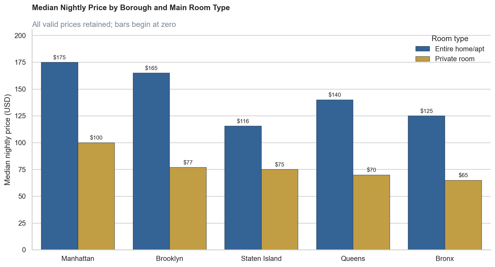

# NYC Airbnb Listings: Pricing, Supply, and Guest Engagement

An end-to-end exploratory data analysis of **20,770 NYC Airbnb listing records**, built with Python, pandas, Matplotlib, and Seaborn. The project demonstrates data-quality assessment, cleaning, feature engineering, robust price analysis, visual storytelling, and business interpretation.

## Executive summary

- **20,724 usable listing records** remain after removing 12 exact duplicates and excluding 34 records missing key analytical fields.
- Manhattan and Brooklyn contribute **75.9%** of the analytical sample.
- The citywide median nightly price is **$125**; borough medians range from **$89 in Bronx** to **$150 in Manhattan**.
- Entire homes/apartments have a median price of **$160**, compared with **$80** for private rooms.
- Price is most strongly associated with capacity: beds have a Spearman correlation of **0.447** with price.
- A critical data-quality limitation affects unique-listing analysis: **38.8% of IDs were exported in shortened scientific notation**.

## Business questions

1. Where are listing records concentrated across boroughs and room types?
2. How do typical nightly prices differ by borough and room type?
3. Which established neighbourhoods combine meaningful volume with higher or lower median prices?
4. How strongly is price associated with capacity, availability, ratings, and review activity?

## Data-quality decisions

- Read `id` and `host_id` as strings to avoid introducing further numeric rounding.
- Removed exact duplicate rows only; the damaged `id` field is not safe for entity-level deduplication.
- Excluded records missing key price, geography, room-type, minimum-stay, or availability fields.
- Used medians and interquartile ranges because prices are strongly right-skewed.
- Bounded only the price-distribution chart at the 99th percentile ($999); segment medians retain every valid price.
- Treated `availability_365` as calendar availability, not verified occupancy.

## Key findings

### Market structure

Manhattan (8,031 records) and Brooklyn (7,694) dominate the extract. Entire homes/apartments represent 55.6% of records, while private rooms contribute 42.4%.

### Pricing

Manhattan has the highest borough median at $150. Entire homes range from $115.50 in Staten Island to $175 in Manhattan; private rooms range from $65 in Bronx to $100 in Manhattan.

### Neighbourhood positioning

Bedford-Stuyvesant has the largest observed volume (1,570 records) and a $113 median price. Among neighbourhoods with at least 50 records, Tribeca has the highest median ($325), while Woodside is lowest ($49).

### Relationships

Price has moderate associations with beds (ρ = 0.447) and bedrooms (ρ = 0.363), but weak associations with availability (ρ = 0.038) and reviews in the last 12 months (ρ = 0.022). These are descriptive correlations, not causal effects.

## Recommendations

- **Benchmark listings more precisely** by comparing properties within the same borough, room type, and capacity group to improve pricing comparisons.
- **Use median and interquartile range (IQR)** alongside average prices to reduce the impact of extreme listings and better understand typical market pricing.
- **Investigate extreme prices and potential outliers** before using the data for revenue analysis, forecasting, or pricing recommendations.
- **Improve data completeness** by obtaining full-precision listing IDs, the dataset snapshot date, booking/occupancy information, and zero-review listings.
- **Incorporate occupancy and booking data** in future analysis to move beyond listing prices and estimate actual revenue and market performance.
- **Develop a pricing strategy** using neighbourhood, room type, availability, and property characteristics to identify opportunities for hosts to optimize their listings.

